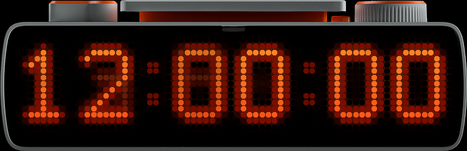

# Nixie clock for the BUSY Bar

Cold-cathode tubes on the front panel of a [BUSY Bar](https://busy.app),
running as a native app on the [VeryBUSY](https://code.mccullough.dev/christian/VeryBUSY)
firmware.




A 7x11 digit of one-pixel stroke inside an 11x16 oval of unlit glass, the
other nine cathodes dim behind it. The gas breathes on three sines per tube,
the glow crawls along the wire, the discharge sputters, and a changed digit
heats up from an ember while the old one cools. Everything is derived from
the clock itself, so a frame is a pure function of the time and the look.

## Controls

- **Setup** has one row, **Seconds**: off shows `hh:mm` on four tubes with a
  colon, on shows `hh:mm:ss` on six.
- While the clock shows, the wheel does the rest:
  - **tap**: the colour, orange, blue, green, red;
  - **turn**: how alive the gas is, 64 steps from a tube in good health to one
    that has been on for years, breathing, crawling and sputtering. A gauge
    along the bottom row shows where you are while you turn;
  - **long press**: the glow profile, the shape of the light around the stroke:
    Classic, Soft, Warm, Soft Warm, Tight;
  - **Back**: the Start screen.
- Everything is remembered across launches.

The back panel mirrors the front with the profile and depth on its breadcrumb.

## Install

The app needs one thing the stock VeryBUSY r7 does not have: the time service
exported to native apps (a [three-file change](firmware/0001-export-the-time-service-to-native-apps.patch),
API 7.1 to 7.2). Until it lands in a VeryBUSY release, the
[release](../../releases) carries a firmware build that includes it. So:

1. Flash `VeryBUSY-r7-fix3-f22-update.tgz` from the release: on the bar's Web
   UI, Settings, Update, upload the file. It is VeryBUSY r7 plus the export
   plus a fix for a timer restart loop with the cloud linked
   ([PR #1](https://code.mccullough.dev/christian/VeryBUSY/pulls/1)). Your
   apps and settings stay.
2. Upload `Nixie.fap` on the Apps tab (drag and drop), or over HTTP:

   ```sh
   curl -X POST --data-binary @Nixie.fap \
     "http://<bar>/api/storage/write?path=/ext/apps/misc/Nixie.fap"
   ```

3. Open Apps on the bar and start **Nixie Clock**.

Once VeryBUSY ships the export, the stock firmware will do and only the `.fap`
is needed.

## Build

`scripts/build.sh` clones VeryBUSY at the pinned commit, applies the export,
drops `app/` into `applications/external/nixie` and builds the FAPs. The
result is `dist/Nixie.fap`. The first run downloads the fork's toolchain.

The renderer has no firmware dependency and a host test:

```sh
app/tests/run.sh
```

It also renders frames on the host; `scripts/render-promo.py` composes them
into the device picture above.

## Layout

| Seconds | Tubes at x | Colons |
| --- | --- | --- |
| Off | 10, 22, 38, 50 | 35 |
| On | 0, 10, 25, 35, 50, 60 | 22, 47 |

Four tubes is the TC002 layout centred on 72 columns. Six tubes packs each
pair to a pitch of ten, the glass overlapping by a column as in one socket,
with colon gaps between the pairs. The rest is in [DESIGN.md](DESIGN.md).

## Credits and license

The tubes were first drawn for the Ulanzi TC002 (52x16) and ported here.
The app shell (`app_shell.h`, Start and Setup) and the build come from
VeryBUSY by Christian McCullough. The BUSY Bar device picture in `docs/` is
Flipper Devices' render, used under CC-BY 4.0; this is an unofficial project,
not affiliated with or endorsed by Flipper Devices or BUSY.

Code: GPL-2.0-or-later, the same as VeryBUSY's first-party code.
